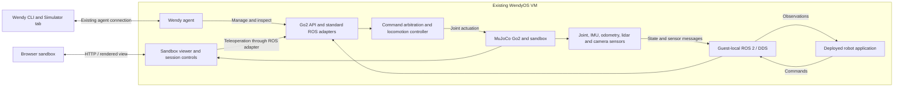

# Unitree Go2 virtual robot for the Wendy simulator

Date: 2026-09-12. Status: core implementation and managed-VM acceptance passed. The sequence below retains the original plan and proposed extensions; measured results and remaining coverage are recorded here.

Implementation status: the runtime, standard ROS loop, native Unitree subset, sensor sandbox, managed profile and typed inspection integration are implemented in [`simulator/go2`](../../simulator/go2/README.md). A separate deployed VM app has passed signed motion, sensor, expiry and reset checks. All 13 finite native SDK checks also pass in the managed 4-vCPU/4-GiB VM, including physical postures, request semantics, CRC/motor ordering and exclusive LowCmd stand/watchdog; see [`native-sdk-vm.json`](../../simulator/go2/validation/native-sdk-vm.json). A separate deployed ROS navigation app passed goal arrival with 0.965 m actual displacement, camera/cloud observations, obstacle stop/resume and stale-scan stop in 37.23 seconds. This is a bounded reactive controller, not Nav2 or precision navigation; see [`navigation-vm.json`](../../simulator/go2/validation/navigation-vm.json). Camera/lidar fault controls pass real ROS lifecycle tests.

Managed startup passes on WendyOS nightly-20260908T175754 using verified legacy IPv4/IPv6 isolation and scoped host-module preparation by the updated agent. Named-VM agent update and reboot followed by robot readiness pass manual checks. A separate read-only ROS app survives inspection and redeployment without resetting the world. Paused reconnect, explicit restart, stopped-runtime recovery and automatic worker crash recovery pass. Two simultaneous VMs expose distinct sandbox ports/native publishers; peer-only ROS motion and reset preserve the primary world and command ownership. See [`vm-lifecycle.json`](../../simulator/go2/validation/vm-lifecycle.json) and [`vm-isolation.json`](../../simulator/go2/validation/vm-isolation.json). The matching checkout agent is required until a supporting release is available; the cached base-image agent does not advertise `go2-virtual-robot`.

**The ten-minute full-subscriber VM gate passed:** 600.015 seconds on four vCPUs/4 GiB, real-time factor 0.9998, received LowState 499.82 Hz, IMU 199.94 Hz, lidar 10.00 Hz and camera 14.83 FPS. All 1,199 physical/freshness samples and 226 signed-motion segments pass; maximum trailing command p95 is 20.31 ms, with no falls, faults or command refresh gaps. The independent pinned SDK checks every tenth native-state CRC. See [`vm-full-load.json`](../../simulator/go2/validation/vm-full-load.json), which records exact runtime/agent identities and complete-log provenance.

Earlier four/six-vCPU diagnostics failed camera throughput and freshness. Investigation found an SPDP reply loop between agent DDS participants; the bounded regression went from 6,513 packets in 150 ms to three packets after the fix. The updated agent includes that fix and the host-network discovery fixes; the successful VM run retains the original renderer settings and sensor content. Earlier failed reports remain in [`validation/`](../../simulator/go2/validation/). A deployed-guest packet escape probe, occupied-port remapping and full Simulator-tab UI walkthrough are not covered by these manual VM reports; firewall and port ownership have separate integration/unit coverage. Factory firmware parity, native video, depth and deterministic ROS-time mode remain outside the implemented profile.

Build a **Go2 robot profile attached to an existing WendyOS VM**. A managed runtime supplies the robot body, controller, sensors, and native ROS 2/DDS interfaces. Applications deployed to that VM can observe the robot and command it through the same interfaces they use on hardware. Movement, collisions, and observations must come from one MuJoCo world.

The target is compatibility for robot applications, with an explicitly supported Go2 interface subset. This is not full emulation of Unitree firmware or its proprietary locomotion controller. A simulation identity remains visible in Wendy; compatibility means application logic can stay the same while device, network, sensor, and clock configuration can differ.

## 1. Recommended architecture

Start with the robot runtime **inside the VM**, packaged as a versioned ARM64 OCI image. Use ROS 2 Humble and CycloneDDS initially, matching current Wendy defaults and the Unitree ROS environment. Keep a normal WendyOS image and provision the robot as a managed workload after the agent becomes ready.

Physics, policy inference, ROS publication, and rendering have separate schedules. Physics owns mutable MuJoCo state; publishers and rendering consume timestamped snapshots. Expensive camera rendering must not block the control loop. Start with software rendering and the existing browser-stream pattern, then measure before expanding graphics quality.

Why this placement fits the current implementation:

- The Simulator tab uses QEMU user networking and existing agent/TCP forwards. It does not provide a host-to-guest DDS network. Keep DDS entirely inside the guest; expose only the browser endpoint and existing Wendy services to the host. See [VM connection](../../internal/cli/commands/vm_ensure.go), [network configuration](../../internal/cli/vm/net.go), and [application port forwarding](../../internal/cli/commands/vm_ports.go).
- The guest is ARM64 with a default four CPUs and 4 GiB RAM, without a configured GPU. Apple Silicon can use HVF and ARM64 Linux can use KVM; x86 hosts use ARM emulation. Initially validate accelerated ARM64 hosts. Do not advertise interactive performance on x86/TCG without measurements. See [QEMU specification](../../internal/cli/vm/spec.go) and [acceleration selection](../../internal/cli/vm/host.go).
- The [G1 Fruit Ninja example](../../../Examples/G1FruitNinjaMujoco/README.md) already demonstrates MuJoCo, OSMesa/EGL selection, separate rendering, browser video, health, and reset. Reuse that plumbing. Its supported pelvis and scripted arm controller do not supply Go2 walking.

**Performance contingency:** if the early VM benchmark fails, move physics, policy, and rendering together into a supervised native host process. Retain the ROS adapter in the guest and connect it using an explicit bidirectional transport through an existing TCP forward. Include session/epoch IDs, sequence numbers, timestamps, bounded queues, disconnect handling, and separate sensor/control channels. Keep motor feedback control on the physics side of that transport. This adds packaging and supervision work, so do not implement both placements before measuring the simpler one. Shared networking and DDS multicast forwarding are not prerequisites for either design.

## 2. The critical missing piece: locomotion

Unitree's [MuJoCo integration](https://github.com/unitreerobotics/unitree_mujoco) supports Go2 low-level motor commands and state. It explicitly describes low-level controller development; it does not supply the high-level sport service that makes `Move` or `/cmd_vel` produce a gait.

The command chain must be:

`Twist or Sport Move → velocity target → walking policy/controller → joint targets and PD torques → MuJoCo contacts → new observations`.

Evaluate the published Go2 policies from [go2_rl_gym](https://github.com/wty-yy/go2_rl_gym), with its [paired C++/ONNX deployment](https://github.com/wty-yy/unitree_cpp_deploy). These supply actual exported policies and a MuJoCo deployment path. They are a concrete prototype candidate, not a Wendy-validated dependency. The [author's model collection](https://huggingface.co/wty-yy/go2_rl_gym_data) declares MIT licensing; preserve the separate code, inherited dependency, and robot-asset notices when packaging.

Prototype requirements:

- Pin the selected checkpoint, matching deployment parameters, MJCF/assets, source commits, and licenses as one bundle. Start with the policy's matching model; a visually similar Menagerie model is not automatically dynamically interchangeable.
- Preserve observation order/scaling/history, action scaling, default joint angles, joint index mapping, actuator limits, PD gains, and policy timestep. The [Python configuration](https://raw.githubusercontent.com/wty-yy/go2_rl_gym/master/deploy/deploy_mujoco/configs/go2.yaml) uses 500 Hz physics and 50 Hz policy updates. The [paired ONNX parameters](https://raw.githubusercontent.com/wty-yy/unitree_cpp_deploy/main/logs/go2/go2_moe_cts_164k_0.6715/params/deploy.yaml) include an SDK joint mapping and observation history; do not combine parameters from different policies.
- Replace upstream joystick/default-forward behavior with zero target at startup. Explicit command ownership selects high-level locomotion or external `/lowcmd`; the two must never drive actuators concurrently.
- Implement supported states: lying/resting, standing, moving, stopping, damping, fallen, paused. A policy trained to walk does not automatically implement stand-up/down transitions or recovery; those need their own validated transitions.
- Use bounded command age and acceleration, finite-value checks, motor limits, and an independent monotonic watchdog. Start with a 200 ms high-level command timeout as a proposed value; determine the shorter external low-level deadline from controller tests.
- Unsupported sport operations return an explicit error. Recovery, jumps, stairs, leases, and motion-switcher behavior are advertised only after implementation and tests.

The initial proof must show a freely moving Go2 held up by its legs and contacts, including forward, backward, lateral, and yaw motion. Updating the root pose directly, replaying a bag, or animating a mesh cannot satisfy this gate.

## 3. ROS 2 compatibility contract

Use two documented surfaces: native Go2 topics for Unitree applications, plus standard ROS topics for navigation and perception. Both derive from the same state and share the same command arbiter. Standard aliases are conveniences supplied by Wendy; they are not claims about stock Go2 firmware.

The repo already contains a [real Go2 topic capture](../../internal/agent/hoststats/rosbattery/testdata/go2-topic-list.txt) and [hardware/message notes](../../internal/agent/hoststats/rosbattery/testdata/README.md). Use those as the initial contract reference. The following rates are **proposed simulator targets**, not measured rates from that robot.

| Interface | Direction from application | Meaning / initial target |
| --- | --- | --- |
| `/api/sport/request`, `/api/sport/response` | Send / receive | `unitree_api/msg/Request` and `Response`; support Move, StopMove, StandUp, StandDown, and Damp after their transitions pass |
| `/cmd_vel` | Send | `geometry_msgs/msg/Twist`; body-frame forward/lateral velocity and yaw rate; standard adapter to the same controller |
| `/lowcmd` | Send, explicit low-level mode | `unitree_go/msg/LowCmd`; joint-level control, mutually exclusive with walking policy |
| `/lowstate`, `/lf/lowstate` | Receive | `unitree_go/msg/LowState`; motor/IMU/contact/BMS state; target 500 / 50 Hz |
| `/sportmodestate`, `/lf/sportmodestate` | Receive | `unitree_go/msg/SportModeState`; posture, mode, pose and velocity; initially 50 Hz, with faster variant after profiling |
| `/joint_states`, `/imu/data`, `/odom` | Receive | Standard messages; target 50, 200, 50 Hz respectively |
| `/tf`, `/tf_static` | Receive | Coherent odom-to-body, joint, lidar and camera transforms; one publisher per transform |
| `/utlidar/cloud`, `/utlidar/imu` | Receive | Go2-facing PointCloud2 and Imu; start cloud at 10 Hz with a documented ray pattern |
| `/scan` | Receive | Navigation scan derived from the same lidar geometry; target 10–15 Hz |
| RGB image + CameraInfo | Receive | Robot-mounted camera, target 640×360 at 15 Hz initially; separate from the observer camera |
| Aligned depth image | Receive, optional attachment | Synthetic depth for perception apps; explicitly a virtual RGB-D attachment, not a stock Go2 sensor claim |
| `/clock` | Receive in simulation-time mode | Sole simulation time source; all participating nodes must opt in |

Unitree uses DDS request/response topics for its sport API, not a conventional ROS service. Implement API IDs, parameter JSON, request identity/correlation, response status and timing according to the [Unitree ROS client](https://github.com/unitreerobotics/unitree_ros2). Test with the actual ROS client and SDK `SportClient`, including clients that wait for responses; merely subscribing to `/api/sport/request` is insufficient. Verify initialization/version-query behavior needed by the chosen SDK client. Map ROS topic names to DDS names correctly (`/lowstate` versus DDS `rt/lowstate`), and test cross-client serialization.

Package generated `unitree_go` and `unitree_api` types from pinned definitions. Preserve fixed message shapes: [LowState](https://raw.githubusercontent.com/unitreerobotics/unitree_ros2/master/cyclonedds_ws/src/unitree/unitree_go/msg/LowState.msg) has 20 motor slots even though Go2 has 12 active actuated joints. Handle inactive entries, headers, ticks, CRC conventions, motor modes, and stop sentinels according to the pinned SDK. Test joint ordering and quaternion/frame conversion explicitly.

Publish BMS state in native LowState so Wendy's existing battery decoder exercises its real path. The captured Go2 has no standard BatteryState topic. Battery drain and temperature may be configurable synthetic models, but they should be internally consistent and documented rather than presented as calibrated electrical or thermal physics. Match native mode and state semantics, including which topics remain available when low-level control takes ownership; debug ground truth can stay available separately.

Match observed QoS where known: captured `/lowstate` is reliable, volatile, keep-last 1. Establish unmeasured topic settings through a compatibility manifest and later read-only capture. Do not mark all sensors best-effort indiscriminately: incompatible reliability/durability can prevent delivery. Use bounded histories and latest-sample scheduling; transient-local static transforms must reach late subscribers. See the [ROS QoS specification](https://raw.githubusercontent.com/ros2/ros2_documentation/humble/source/Concepts/Intermediate/About-Quality-of-Service-Settings.rst).

## 4. Make the observations believable

The distinguishing requirement is causal consistency: turning the robot changes the camera, lidar, IMU, odometry, contacts, and joints together.

- Build a small sandbox containing a floor, walls, and movable boxes. Generate lidar by ray intersections with that world, with configured extrinsics, range limits, occlusion, scan timing, and optional seeded noise/dropout. A flat 2D scan is the first navigation slice; Go2-like 3D lidar follows.
- Generate IMU acceleration and angular velocity at the sensor mounting site, with correct gravity/specific-force and rotation conventions. Derive joint positions, speeds, torque estimates, and foot contact forces from MuJoCo.
- Define `odom → base_link → sensor frames`, including optical camera conventions and joint transforms. A localization/SLAM node owns `map → odom` when enabled. Do not have simulator and localization publish competing transforms.
- Initially expose ideal physics pose only on an explicit debug ground-truth interface. Application `/odom` should follow a documented estimator model, with realistic nonzero covariance, optional bias/noise, and drift. Ground truth can underpin the first estimator approximation, but it does not establish realistic localization behavior.
- Capture RGB/depth and corresponding CameraInfo from the same sensor pose and timestamp. Camera motion must reflect the robot body; the browser orbit camera is independent.
- Keep noise deterministic when seeded, and expose latency, sample rate, dropout, and sensor loss as later scenario controls. Do not claim photorealistic vision or a calibrated Go2 lidar scan pattern in the first release.

Native `/frontvideostream` is a later compatibility target. The [existing hardware validation](../../../Documentation/2026-08-28-pr-1827-go2-hardware-validation.md) found a firmware-specific CDR/H.264 layout different from the upstream JPEG-shaped definition. Start with standard ROS Image/CameraInfo, then add captured-layout tests for native video if required. Testing Wendy's camera-entitlement/V4L2 route also requires the compatible v4l2loopback module in the VM; direct ROS image subscriptions do not.

## 5. Networking, clocks, and command lifetime

**Guest ROS bus:** use domain 0 initially for compatibility with the existing Unitree SDK backend, and bind simulator DDS participants to guest loopback with no external discovery peers. All robot-facing applications use the guest host network and an explicitly shared ROS domain. Host networking here means the VM's network namespace.

Wendy currently defaults to an app-derived domain and app-local discovery. Add an explicit simulation runtime configuration that resolves robot-facing apps to the profile's domain, middleware, and loopback routing. Preserve the source manifest; validate conflicting application choices and report them instead of silently connecting an app to a different robot bus. Domain ID and Cyclone configuration alone are not isolation: SDK code can explicitly select another interface. Provision guest network rules that deny the supported robot DDS traffic on non-loopback interfaces, while allowing required download/application traffic. Reject external discovery/interface configuration in the managed profile and verify confinement with packet capture while unrelated real devices are connected. This guarantee covers the managed robot participants and supported clients; it is not a security claim about arbitrary application code with unrestricted networking.

**Two clock contracts:**

- Default device mode runs paced at 1× with system-time sensor timestamps, compatible with ordinary hardware-facing nodes. Pause stops new sensor samples and cancels active motion, causing freshness checks to expire. Reset creates a new world epoch without rolling wall timestamps backward; reset estimator/navigation state before accepting another goal.
- Deterministic test mode uses MuJoCo time, `/clock`, and `use_sim_time=true` on every participating ROS node. Clear old goals, queued commands, TF/estimator caches and observation history across reset/epoch changes. A message from a previous epoch must never restart movement. Existing RobotNavigation launch files hardcode `use_sim_time=false`, so this mode needs an explicit launch configuration, not just a clock publisher.

Reset must revoke control ownership and disarm command acceptance before touching the world. Cancel/reset managed navigation goals, clear policy history, and drain or recreate command subscriptions. `/cmd_vel` is unstamped and native SDK requests carry no Wendy epoch, so internal epoch checks alone cannot reject a still-running old publisher. Require a deliberate new control grant after reset, with stale publishers/goals stopped and the current command source identified; do not automatically resume on the next received Twist. Validate this behavior with a publisher that continues sending throughout reset.

Hardware/command timeouts always use a monotonic clock so pausing ROS time cannot preserve a stale command. The [ROS clock design](https://design.ros2.org/articles/clock_and_time.html) distinguishes simulated ROS time from steady time and requires handling backward jumps. Raw SDK consumers do not automatically adopt ROS time; validate them in device mode first.

## 6. Integration into Wendy

| Area | Planned change |
| --- | --- |
| [VM metadata](../../internal/cli/vm/state.go) | Add optional profile reference; store versioned `robot.json` with robot/world/policy/runtime digests, ROS contract, sensor configuration, clock mode and seed |
| [Simulator picker](../../internal/cli/commands/device_picker_simulator.go) | Offer Generic WendyOS / Unitree Go2 when creating a simulator; show Robot and independent readiness; open sandbox, reset world, pause/resume |
| [VM startup](../../internal/cli/commands/vm_ensure.go) | After agent readiness, reconcile profile runtime, configure sensors/ROS, start it and wait for robot readiness before deploying a robot app |
| Managed workload lifecycle | Give the runtime a stable reserved identity and restart policy; restart/redeploy of a user app leaves the world running; VM shutdown stops it; world reset is separate from VM stop/removal |
| [Port forwarding](../../internal/cli/commands/vm_ports.go) | Reserve the sandbox TCP endpoint through existing machinery; identify it by VM/session rather than assuming a global port; test two concurrent simulators |
| [ROS configuration](../../internal/shared/appconfig/ros2.go), [container setup](../../internal/agent/containerd/client.go) | Resolve the profile's guest-local robot bus explicitly; detect wrong domain/interface/middleware and ensure client message dependencies |
| [ROS sidecars](../../internal/agent/containerd/ros2.go) and [service routing](../../internal/agent/services/ros2_service.go) | Add a deterministic simulator-owned typed inspection target and source its pinned Unitree overlay; do not depend on which user app happens to be selected as anchor |
| [Battery discovery](../../internal/agent/hoststats/rosbattery/config.go), [camera discovery](../../internal/agent/ros2camera/manager.go) | Explicitly include the simulation bus; existing physical-host discovery assumptions can skip loopback/virtual interfaces |
| Robot runtime, `go/simulator/go2/` | Container build, MuJoCo world, controller integration, native/standard adapters, sensors, web viewer, health, provenance and integration harness; kept alongside the CLI that will provision it |

The app inspector forces localhost-only discovery, which is compatible with this loopback topology. The managed simulation integration now supplies an explicit validated Unitree setup path and scoped sidecar identity/routing. Validate typed inspection with another ROS app running concurrently; merely installing an overlay in a user image is insufficient.

Keep the standalone [host inspector](../../internal/agent/containerd/ros2_host.go) read-only. Applications publish commands directly over DDS; browser teleoperation can use a simulator-owned ROS client. The generic agent's CLI parsing/echo stream is an inspection plane, not the high-rate robot data path.

Robot readiness must cover model/policy load, advancing physics and state, controller availability, topic/type discovery, a decoded sensor sample, and a valid rendered frame when the viewer is enabled. Report `provisioning`, `starting`, `standing`, `ready`, `paused`, `fallen`, and `fault` independently of VM power state. A ready agent socket alone is insufficient. Asset downloads and container pulls need resumable/idempotent provisioning, visible failures and cleanup of incomplete sessions.

## 7. Delivery sequence and acceptance gates

1. **Prove walking and VM performance.** Package the candidate with its exact model/configuration; run headless in an accelerated ARM64 WendyOS VM, then add software rendering. Prove stand/stop, signed forward/backward/strafe/yaw commands, falls and reset. Measure policy latency, physics overruns, memory, real-time factor and camera cost with a representative application load. Proposed interactive gate: sustain approximately 1× for ten minutes, 50 Hz policy updates, p95 command-to-controller latency under 100 ms, and 15 fps at 640×360. These are acceptance targets, not current results. Adjust profile resources or select the host placement before building the rest if this fails.

2. **Close the ROS loop.** A separate app in the VM sends `/cmd_vel`; a real gait moves the body; `/joint_states`, IMU, odometry, TF and a basic scan return from that physics world. Assert signed displacement and yaw, bounded tracking error, contact-supported motion, changing range observations, and stopping after command expiry. The client must be a deployed app, not an in-process test bypassing DDS.

3. **Add native Go2 compatibility.** Publish typed LowState/SportModeState and implement the supported sport request/response subset. Exercise the actual Unitree ROS client and SDK Move/StopMove, invalid requests and unsupported API errors. Validate read-only topic decoding, native battery telemetry, fixed message shapes/QoS, and exclusive external low-level control with a stand test. Freeze the supported interface manifest for this release.

4. **Add the sensor sandbox.** Provide robot camera, browser observer view, world obstacles, 3D lidar and optional RGB-D attachment. Derive `/scan` from the lidar model and support sensor dropout. Run a separate integration harness based on [RobotNavigation's existing smoke test](../../../Examples/RobotNavigation/tests/ros_smoke.py): navigation goal → guarded command → MuJoCo walking → updated perception and arrival; obstacle and stale-scan scenarios must stop progress. Validate positive odometry covariance and required TF/IMU readiness. The current untracked RobotNavigation work is reference material, not something this planning change modifies.

5. **Integrate the profile and lifecycle.** Simulator tab creation provisions the runtime automatically; ordinary `wendy run --device vm:<name>` (or `--device sim` for the default simulator) deploys the user app once the robot is ready. Verify persisted world/profile settings, app redeployment, VM reboot, robot crash/recovery, reset, closing the initiating terminal, two simultaneous VMs, port conflicts, and isolation from LAN DDS. World reset must discard active commands/goals and controller history.

6. **Validate fidelity and publish the compatibility boundary.** Compare supported topics, types, QoS, fields, rates and video layout against existing fixtures and a bounded read-only capture from the target Go2 firmware when available. Record firmware/profile provenance and measured differences. Include reproducible smoke scenarios and benchmark results; unsupported cloud/audio/AI/firmware services remain explicitly outside the profile.

The first milestone is complete only when a deployed VM application can make a Go2 physically walk in MuJoCo and consume sensor changes caused by that motion. The full feature is complete when the same loop is provisioned through the Simulator tab, survives its lifecycle, supports the documented native Go2 command subset, and passes navigation/obstacle scenarios.

## 8. Scope and remaining decisions

Proceed with one Go2 per VM, accelerated ARM64, flat indoor sandbox, Humble/CycloneDDS, velocity commands plus the validated basic sport subset, and explicit sensor attachments. Support multiple independent VMs before attempting several robots in one DDS graph.

The two main uncertainties are **controller/model performance in the VM** and **the exact Go2 firmware contract to match**. The first is resolved by gate 1; the second starts from the committed real-robot evidence and becomes a versioned compatibility profile. Do not make pretrained-controller availability, exact factory gait parity, GPU passthrough, native video encoding, arbitrary third-party app compatibility, or full Go2 API coverage hidden assumptions in a delivery estimate.

Implementation validation uses a dedicated `go2-sim` VM. No physical robot connection or control is required by this sequence.
