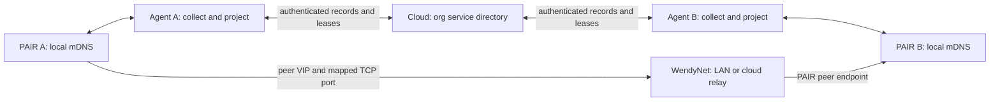

# Fleet mDNS discovery over WendyNet

Date: 2026-09-07

Status: Proposed — design and implementation plan; no runtime changes

Baseline: WendyOS `origin/main`, `de38678cc`

## Outcome

Two cloud-enrolled WendyOS devices in the same organization, on different LANs,
should discover each other's NVIDIA Personal AI Router (PAIR) instances, complete
PAIR's PIN pairing, and route inference through WendyNet. No public inbound ports,
manual peer IP addresses, or shared multicast network should be required.

Build an organization-scoped DNS-SD service directory with a local mDNS projection
for applications that browse `.local`. Agents exchange service records through
the cloud; WendyNet carries the resulting TCP connections. This is service
discovery across the fleet, not a layer-2 network or a multicast packet tunnel.

PAIR is the first compatibility profile and the release acceptance case. Generic
DNS-SD browsing alone is not sufficient to call that profile supported.

## Existing implementation and gaps

Paths below are relative to this repository:

| Existing component | What it provides | Gap for PAIR |
|---|---|---|
| `go/internal/agent/mesh/dns.go` | Device-name resolution to mesh VIPs, with listeners on app bridge gateways | No fleet service directory or mDNS responder for app browsers |
| `go/internal/agent/services/mesh_roster.go`, `Proto/cloud/mesh.proto` | Cloud device-name roster | No service records, leases, or service-change subscription |
| `go/internal/agent/containerd/mesh_wiring.go` | App namespace routes, DNS, and lifecycle ownership | No namespace-scoped discovery collector/responder |
| `go/internal/agent/mesh/proxy.go`, `go/internal/agent/services/mesh_dialer.go` | TCP relay, LAN-first with cloud fallback | No UDP multicast transport; retain TCP for this design |
| `go/internal/agent/services/mesh_service.go`, `go/internal/agent/hostnetwork/mesh_ports.go` | Peer dial to host loopback, with explicit ingress forwards to mesh containers | No dynamic service-owned port leases or discovery-derived authorization |
| `go/internal/shared/discovery/` | Wendy device discovery on a physical LAN | Not an app-service inventory and not a cloud fleet service registry |

The earlier [instant discovery design](2026-08-07-instant-mdns-discovery-design.md)
improves CLI latency on a LAN; this plan adds a different agent-side capability.
Preserve the existing [mesh addressing](2026-07-18-mesh-friendly-name-addressing-design.md)
and numeric VIP behavior.

## PAIR contract to preserve

Use PAIR **v0.1.1**, commit `13b68115fa2c9c1d94f1ead1358f8d5a527cfecf`, as the
initial compatibility fixture. Its [node record implementation](https://github.com/NVIDIA/Personal-AI-Router/blob/v0.1.1/services/shared/noderec/noderec.go)
and [scanner tests](https://github.com/NVIDIA/Personal-AI-Router/blob/v0.1.1/services/nvpair-node-scanner/directory_test.go)
establish these requirements:

- Browse `_nvpair-node._tcp.local.` using PTR, SRV, TXT, and address records.
- Preserve `v`, `uuid`, and `cluster-uuid`; PAIR's UUID is distinct from Wendy's
  authenticated device identity. Reject/quarantine conflicting PAIR UUIDs across
  publishers instead of silently merging them.
- Project both TXT `ip` and comma-separated `ips` to the target device's VIP in
  the **receiving app's** service CIDR. PAIR prefers these to resolved addresses.
- PAIR ignores the SRV port for service routing. Its TXT service map contains
  `ni`, `ol`, `lm`, `er`, `wl`, `cl`, `em`, and `ec`. A profile must understand all
  supported keys and map every reachable endpoint, including changes after
  pairing or engine restart. Unknown profile versions fail visibly.
- `ol`/`lm` indicate engine availability; do not infer that raw engine ports are
  the approved peer inference ingress. Trace the broker's promoted proxy endpoint
  selection and expose the paired proxy's TLS ingress. Keep local plaintext
  inference and broker management private.

DNS rewriting is only part of compatibility. PAIR's
[pairing messages](https://github.com/NVIDIA/Personal-AI-Router/blob/v0.1.1/services/nvpair-cluster-manager/pairing.go)
carry a return `addr`, and its cluster manager remembers observed socket peers.
WendyNet terminates and recreates TCP connections, so the peer may see a gateway
or loopback source rather than the initiating device's VIP. Both callback address
selection and later membership reconciliation must be verified in both directions.

Do not rewrite PAIR's handshake payloads or terminate its TLS inside the discovery
bridge. If stock PAIR cannot select a fleet-reachable return address, the profile
requires a small, version-pinned PAIR change for explicit advertised identity/
endpoint selection and discovery-based reverse lookup. Prefer upstreaming it.
Shipping that supported build in the template is a dependency, not a requirement
for users to configure addresses manually. Phase 0 must settle this before the
directory and projection contracts are frozen.

## Architecture



### App opt-in and scope

Add discovery settings to the `network` entitlement for `mode: "mesh"`. The
following shape is a proposal, not syntax accepted by the current CLI:

```json
{
  "type": "network",
  "mode": "mesh",
  "serviceCIDR": "10.99.0.0/16",
  "discovery": {
    "publish": ["_nvpair-node._tcp"],
    "browse": ["_nvpair-node._tcp"],
    "profile": "nvidia-pair-v1"
  }
}
```

Publication and browsing are explicit, independently scoped to service types.
The profile defines permitted endpoint roles and TXT transformations; TXT records
alone never grant network access. An app cannot export arbitrary listeners,
another app's records, or services merely overheard on the physical LAN.

Initially support isolated Linux mesh app namespaces on WendyOS, with one PAIR
node per device. Run PAIR and its local engine/client in that namespace. The
host-network LAN template must become a separate selectable network mode; changing
only its discovery configuration cannot install mesh routes on the host. Native
desktop PAIR on an unenrolled Mac/Windows machine is outside the first fleet
release; it can still participate through ordinary LAN pairing separately.

### Local collection and endpoint registration

Manage one discovery helper per opted-in app network namespace, with lifecycle
ownership patterned after `ensureMeshDNS`/`releaseMeshDNS`. Use a supervised helper
process or dedicated namespace-bound sockets; do not switch arbitrary Go runtime
threads between network namespaces. No `host-admin` grant is required for the app.

The helper browses approved types on the app-side interface, assembles complete
record sets, and validates source namespace, local addresses, service type, and
endpoint ownership. If an app-group bridge is shared, enforce publisher ownership
using a runtime-issued local registration capability or isolate publishers; packet
source and a claimed TXT UUID alone cannot distinguish sibling applications.

For PAIR, combine the observed advertisement with the profile's verified broker
endpoint state where TXT does not describe the actual peer proxy listener. Read
only the necessary status through app-scoped IPC. Never upload its control socket,
private keys, PINs, prompts, model contents, or unrelated environment/settings.

Allocate a per-device external TCP port for each permitted endpoint role and map
it to the owning container's current address and port. Reuse the existing VIP and
mesh-port path; do not require container and external port numbers to match.
Port leases belong to `(app, service, role, generation)`, coexist with static
`network.ports`, and cannot displace another app's lease. Install and verify the
forward before publishing its record. Update endpoint mappings and discovery
records as one generation; withdraw records before releasing ports, and delay
port reuse until the old advertised lease/TTL has expired.

Extend ingress policy for these dynamic registrations: both LAN MeshDial and
cloud relay must resolve only live, authorized leases. Do not turn an arbitrary
TXT port into access to a host loopback service. This is additive policy for the
new facility; retain documented behavior for existing static mesh ports.

### Cloud directory

Introduce a dedicated service-discovery RPC alongside the device roster. Proposed
operations: publish/renew a generation of local services, withdraw it, and watch
an authorized snapshot plus ordered updates. These are new contracts, not existing
RPCs. Coordinate proto ownership/code generation with the separate Wendy Cloud
repository and its deployed API/identity version; do not copy historical integer
asset-ID examples into a newer identity contract.

Each record carries the server-derived organization/device identity, app/service
ID, publisher boot/session epoch, monotonic generation, service type, instance
label, profile version, bounded TXT data, endpoint-role/external-port map, and
lease expiry. Carry semantic endpoint identities, not private LAN addresses or a
publisher's service-CIDR-specific VIP. The receiving agent renders addresses.

- Authenticate publishers/watchers through proven device identity and validate
  current enrollment/organization membership, including on long-lived streams.
  Clients cannot choose a publishing organization or impersonate another asset.
- The server checks the organization mesh feature and discovery policy for both
  publish and watch. Enforce limits per app, device, org, and subscriber.
- Start with 60-second leases renewed every 20 seconds; projected TTL is at most
  30 seconds and never exceeds remaining lease life. These are initial testable
  settings, to be tuned from measured reconnect behavior.
- Fence old sessions after reconnect/reboot. Watchers receive an atomic snapshot
  and revision cursor, then changes; sequence gaps force a new snapshot. Withdrawal,
  lease expiration, asset deletion/move, or feature revocation produces removals.
- Keep cloud state ephemeral or expiry-indexed; no durable history of TXT bodies
  is needed. Persisted caches must not extend service leases after a reboot.

### Local mDNS projection

Each receiving helper synthesizes records only on the opted-in app link. It
answers the stock application's `.local` browse and resolve requests; modifying
the app's unicast DNS resolver alone does not satisfy mDNS clients. No fleet
records are announced onto physical LAN/Wi-Fi interfaces.

Give synthetic instance and target names a stable suffix derived from publisher
device/service identity. Preserve the service type and PAIR UUID while avoiding
collisions with native names. Answer PTR, SRV, TXT, A, and related queries as a
consistent set. Generate A records from the receiver's mesh VIP mapping. Do not
emit unusable remote link-local/private addresses or AAAA until an IPv6 data path
exists. Keep valid PAIR SRV placeholder semantics; rewrite its TXT endpoint map
according to the profile rather than treating SRV as authoritative.

Implement normal mDNS probing/conflict handling, known-answer suppression, QU/QM
responses, cache-flush semantics, announcements and TTL-zero goodbyes. Use link
TTL/hop-limit rules and explicit interface binding, and prove coexistence on UDP
5353 with PAIR's own responder. Limit record sizes, response fan-out, update rates,
and pending resolves. A standard DNS-SD profile preserves TXT bytes unless it
explicitly understands their semantics; PAIR gets a versioned transformation.

Track origin device/service/generation outside TXT. Imported records must never
be re-exported: match synthetic names and helper-owned origin state, suppress
local self-echo, and export only locally owned app records. A TXT marker by itself
is insufficient. Confirm duplicate handling when the same PAIR UUID is visible
through both LAN and fleet paths; use the fleet view consistently in mesh mode.

## Trust, availability, and operational behavior

Fleet enrollment authenticates the publisher's device, not the truth of its app's
TXT fields. PAIR still requires its own explicit PIN acceptance and certificate
trust. Do not auto-pair devices merely because they belong to the same org.

The [PAIR security contract](https://github.com/NVIDIA/Personal-AI-Router/blob/v0.1.1/SECURITY.md)
distinguishes local plaintext client requests from paired TLS proxy ingress on
the same listener. Mesh traffic must arrive with a non-loopback source at that
listener so a same-org but unpaired device cannot gain local-client privileges.
Test this through both direct and cloud paths. Do not expose raw Ollama/LM Studio
ports as a workaround or downgrade PAIR's TLS. Relay opaque bytes for paired
inference; cloud service discovery contains metadata, while cloud fallback may
also carry PAIR-encrypted inference bytes. Do not describe this mode as LAN-only.

On a cloud disconnect, retain imported records only until their existing leases
expire; withdraw them locally afterward. Existing TCP sessions need not be killed
solely because discovery expires, but new connections require a live endpoint
lease. Explicit authorization revocation must stop new publication/dials and close
affected discovery-owned sessions on both paths. Policy caches have bounded
lifetimes and fail closed after expiry. Ordinary non-fleet LAN discovery continues.
Offline cross-site discovery and indefinite stale caches are not promised in v1.

Export metrics for local/published/projected record counts, rejected records,
lease age, watch lag/reconnects, collisions, and endpoint dial outcomes. Logs use
service IDs/reasons, not full TXT payloads or PAIR secrets. Add a CLI inspection
surface showing publisher, profile, endpoint mapping, expiry, and why a record
was withheld. Failure disables this feature for the affected app, not the agent.

## Implementation sequence

Every phase produces a separately reviewable change. The cloud work and PAIR
packaging work are required dependencies in their own repositories.

### 0. Prove PAIR compatibility before freezing the profile

- [ ] Capture real v0.1.1 advertisements before/after pairing and engine start,
  including all TXT roles and actual promoted proxy listeners.
- [ ] Build a two-namespace harness with no shared multicast/LAN, distinct private
  subnets, TCP relay and synthetic VIPs. Project records in both directions.
- [ ] Prove invitation in each direction, PIN completion, return `addr`, observed
  peer-address behavior, membership reconciliation, model discovery and inference.
- [ ] If necessary, implement and upstream a narrow PAIR advertised-endpoint /
  reverse-address fix; record its patch/commit and test it through the harness.
  No TLS or handshake-payload interception. Freeze the profile only after this
  works, and distinguish stock from patched-build compatibility in documentation.

### 1. Agent model and entitlement

- [ ] Extend `go/internal/shared/appconfig/` and its schema/docs with separate
  publish/browse opt-in, approved types, and a versioned profile.
- [ ] Add a discovery package under `go/internal/agent/` for normalized service
  records, origin/generation tracking, validation, leases, and profile transforms.
- [ ] Test policy rejection, malformed/oversized DNS and TXT, duplicate identity,
  receiver-specific VIP rendering, and absent/unknown profile versions.

### 2. Owned ingress and namespace lifecycle

- [ ] Extend `containerd/mesh_wiring.go` and hostnetwork mesh-port management with
  endpoint leases, atomic publication ordering, stale-generation fencing, port
  collision checks and restart reconstruction. Keep static port tests intact.
- [ ] Add per-app helper lifecycle and capability-scoped registration. Test
  repeated start/stop, crash, partial setup failure and agent reboot; no leaked
  sockets, goroutines, helpers, records, DNAT rules, or prematurely reused ports.
- [ ] Apply the same endpoint authorization/revocation checks to direct MeshDial
  and cloud-relay ingress. Verify non-loopback peer semantics for PAIR.

### 3. Cloud contract and directory

- [ ] Coordinate authoritative proto changes and generated clients with Wendy
  Cloud; keep `GetMeshRoster` clients compatible. Build the scoped registry,
  lease sweeper, publisher-session fencing and snapshot/watch protocol.
- [ ] Test cross-org access, forged publisher IDs, asset transfer/deletion,
  mesh-disabled policy, expired credentials, watch revocation, reconnect races,
  quota exhaustion and duplicate/reordered updates.
- [ ] Implement the agent publisher/subscriber next to the mesh roster and dialer
  integration; feature-negotiate older servers and report unsupported capability.

### 4. mDNS collector and projection

- [ ] Implement app-link capture and synthetic responses, with the DNS behavior
  above and a PAIR profile using the phase-0 fixtures.
- [ ] Test query/announcement/goodbye flows with a real PAIR browser as well as a
  standards-based browser. Verify late subscribers, responder coexistence, name
  conflicts, self-filtering, no re-export loops and no physical-LAN leakage.
- [ ] Extend mesh DNS only where ordinary hostname resolution needs the same
  synthetic target mapping; keep existing numeric/friendly-name behavior unchanged.

### 5. Template, diagnostics, and release gate

- [ ] Add a WendyNet network option to the `nvidia-pair` template in
  `wendylabsinc/templates`, selecting the supported PAIR build and discovery
  profile. Retain LAN mode. Reject unsupported agents with an upgrade message.
- [ ] Add inspection/logging docs and describe cloud metadata and relay behavior.
- [ ] Run the acceptance matrix below on real enrolled devices. Enable a small
  opt-in cohort first; expand only after failure/reconnect and revocation pass.

## Acceptance matrix

| Scenario | Required evidence |
|---|---|
| Separate NATed networks, same org | Both PAIR nodes appear without entering peer IPs; no UDP 5353 crosses sites; discovery converges within 10 seconds of an acknowledged publication under normal conditions |
| Pair in either direction | Stock UI or headless broker shows invitation/PIN and reaches paired state; return connections and membership reconciliation use reachable mesh endpoints |
| Local and remote inference | A model installed only on B answers a request to A's local proxy; job attribution names B; streaming response completes over cloud fallback |
| Load distribution | With the same model on both nodes, concurrent requests can reach both eligible nodes; do not assert a fixed scheduler split |
| Dynamic endpoints | Engine/proxy restart, port collision and post-pairing `ec` appearance update mappings before advertisement; no request lands on a stale/reassigned port |
| Address semantics | Different receiver service CIDRs, overlapping physical LAN ranges, duplicate hostnames and observed peer source addresses do not redirect traffic incorrectly |
| Direct/fallback | Allow then block agent LAN connectivity; new requests use the appropriate path without changing application-visible records; do not promise migration of an in-flight TCP stream |
| Lifecycle | Graceful stop sends withdrawal; abrupt loss disappears no later than the lease bound; reconnect/reboot cannot resurrect old generations |
| Authorization | Cross-org publisher/watcher/dial rejected; same-org unpaired plaintext proxy request rejected; PAIR certificate failure is not downgraded; revoked discovery-owned sessions close |
| Isolation and compatibility | Non-opted-in apps and physical LANs see no fleet services; local Avahi/PAIR coexist; older agent/cloud combinations retain LAN behavior and report fleet capability unavailable |
| Scale | Start with 100 devices / 1,000 total services per org under churn; measure memory, fan-out, reconnect and expiry, and enforce documented quotas before general availability |

The end-to-end gate is remote inference plus pairing and lifecycle correctness,
not a screenshot of discovered names. Retain sanitized DNS/RPC traces, endpoint
maps, versions and transport metrics as test artifacts; exclude PINs and keys.

## Rollout and alternatives

Deploy backward-compatible cloud capability first, then opt-in agent support,
then the PAIR template option. Disabling discovery withdraws its advertisements
and registrations and stops projection without removing unrelated static mesh
ports or PAIR's persistent identity/models. Exercise this rollback in the cohort.

Forwarding multicast packets over the broker would bring loops, link-local
addresses and unwanted services into the fleet without fixing PAIR callbacks.
Wide-area unicast DNS-SD is useful for applications that support browsing domains,
but it does not replace the local mDNS view required by PAIR. Manually adding
nodes is useful diagnostically, not the acceptance path for fleet discovery.

Protocol references: [mDNS (RFC 6762)](https://www.rfc-editor.org/rfc/rfc6762.html)
defines local multicast behavior; [DNS-SD (RFC 6763)](https://www.rfc-editor.org/rfc/rfc6763.html)
defines service record relationships. [Discovery Proxy (RFC 8766)](https://www.rfc-editor.org/rfc/rfc8766.html)
is useful precedent for collecting scoped discovery data. The cloud registry and
app-local projection proposed here are a Wendy design, not a claim of RFC 8766
conformance.
