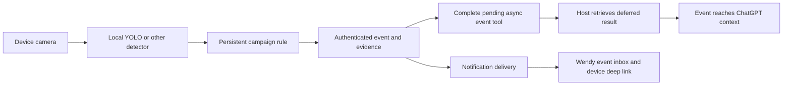
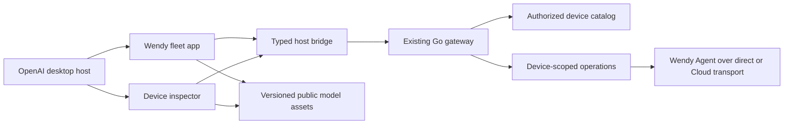

# Wendy devices in OpenAI desktop apps

Proposed implementation plan, 2026-09-30. This is a design and delivery plan, not an implementation or deployment record.

Build a device workspace inside the OpenAI desktop host. A single **Wendy** entry in global navigation opens the user's fleet, with a recognizable 3D representation of every device. A **Device inspector** tab beside a conversation shows the device being discussed. Both use the same catalog, device identity, components, and gateway operations.

The product must support installing, developing, deploying, and scaling robotics and Edge AI. Those are first-class workflows in this plan. The 3D fleet is the shared way to choose hardware, inspect compatibility, and follow outcomes throughout that lifecycle.

Keep the existing `wendy-robots` plugin identity and Go gateway. Broaden the product language to devices without breaking existing robot tool calls or grants. Use the host's composer and conversations. Wendy owns the device views and operations.

The protocol reference is OpenAI MCP Extensions [revision e314720](https://github.com/openai/mcp-extensions/blob/e314720a0daac326217d1f123fcf51647868fa9f/docs/spec.md). The spec describes expected launch support, so actual host behavior remains an implementation acceptance gate. The browser SDK baseline is [node-v0.1.0](https://github.com/openai/mcp-extensions/releases/tag/node-v0.1.0), with exact compatible dependency versions recorded in the lockfile. Do not copy extra fields from moving README examples unless the pinned types, protocol, and host agree.

## Install, develop, deploy, and scale

The app's main destinations are Devices, Projects, Simulators, Deployments, and Fleet. "Add device" starts installation or enrollment. A selected device can also open its project, test a build, or join a rollout. These workflows use the same stable device IDs and thread context.

| Outcome | User workflow | Existing Wendy foundation | Work this plan adds |
| --- | --- | --- | --- |
| Install | Choose hardware, follow physical setup, provision OS or Agent, configure connectivity, verify first boot, enroll | `os_install_plan`, `os_list_drives`, persistent install jobs, `os_install_verify` | Visual setup, model-specific instructions, resumable progress, and the connection from a completed install to its fleet card |
| Develop | Open/create a project, choose real or simulated hardware, validate, build, test, inspect failures, iterate with the coding agent | `project_validate`, CLI build/run, simulator tools, desktop sessions, ROS inspection and telemetry | Project/device workspace, explicit target binding, build/test jobs, and relevant diagnostics attached to the conversation |
| Deploy | Review release and target compatibility, deploy, check services, verify actual app or ROS output | `run`, explicit direct/Cloud selectors, app inspection, logs/metrics | Persistent deployment records, immutable release identity, readiness evidence, and recoverable operations |
| Scale | Select a group, preview placements, test a canary, roll out in stages, compare versions/health, stop or recover failures | `wendy fleet group`, `fleet run`, `fleet apps`, `wendy-fleet.json` placement and peer discovery | Scoped MCP fleet tools and durable rollout orchestration with health gates, history, and recovery |

Installation selects the correct hardware path before any disk operation. Pi and supported Jetson image flows use the existing installer. Unitree G1 PC2 preserves vendor Ubuntu and installs the Agent. Show physical instructions with the selected model, retain the exact-target erase authorization, and hand elevation back to the supported local installer. A completed write is not a completed install until first boot and identity verification succeed.

Development keeps code editing in the host's coding workspace. Wendy provides hardware, project validation, build/run jobs, and device evidence. Resolve a locally selected project to a registered workspace handle; do not accept a remote user's arbitrary filesystem path. A hosted gateway cannot open or build an unshared folder on the user's laptop. Expose a clear local-runner connection state and use scoped local workflow tools through the same plugin backend.

For robotics, make simulation, ROS nodes/topics, camera output, and the selected physical robot visible together. Add a hardware-in-the-loop workflow using the existing CLI path where supported. The current HIL path requires an attached session, while the MCP `run` tool always detaches, so this needs its own persistent job adapter. Simulation success and hardware success remain separate evidence.

For Edge AI, record the model artifact/version, target CPU/GPU architecture, accelerator/runtime requirements, memory budget, and required sensors in the release. Add reproducible on-device smoke tests and performance measurements such as latency, throughput, memory, temperature, and power when reported. Use those results to help select hardware and gate deployment. A model file fitting on disk or a container reaching RUNNING does not demonstrate usable inference.

Deployment uses a persistent operation ID with build, transfer, start, verification, and terminal states. Retain the source revision, image/model digests, configuration revision, exact target IDs, and verification results. Closing an app tab must not lose the operation record. Reopening attaches to status instead of launching the job again. A local runner interruption records an uncertain outcome and reconciles against device state.

Fleet scale builds on the existing CLI rather than introducing another group system. Cloud groups currently use asset tags; LAN matching uses device-name patterns. Preserve that distinction in targeting. Resolve and display the exact authorized membership before starting a rollout, then freeze that membership for the job. A changing group must not silently add devices to an in-flight deployment.

The inspected fleet deploy code runs targets sequentially and reports per-device outcomes. It does not establish a durable staged rollout with readiness gates. Add that orchestration explicitly: canary selection, bounded batches, pause/cancel, health thresholds and observation windows, resumable state, and a complete per-device history. The single-device MCP `run` tool deliberately rejects comma-separated targets, so fleet deployment needs a separate reviewed API. Current `fleet run` also rejects Compose projects; report this until the backend supports them.

Partition mixed fleets by compatible CPU/GPU/runtime requirements and build an immutable artifact per supported cohort. Promote the same tested artifact within a cohort. Do not assume one CUDA image or optimized model engine works across every board. Extend existing component placement for distributed applications and verify peer reachability and app readiness independently of generated discovery metadata.

Recovery redeploys a retained, known-good release only when its configuration and persistent-data contract support that action. Include a dry-run impact report, original release references, and per-device recovery results. Offline targets remain deferred or failed according to an explicit expiry policy. Never launch a stale queued robot operation simply because a device reconnects. OS fleet updates need their own update/boot-health checks and are not implied by app rollback.

The end-to-end acceptance scenario is a robotics or vision project that provisions one device, validates and tests in simulation, runs on real hardware with verified output, and promotes a compatible release to a group with a failing canary correctly stopping progression.

## Camera understanding and persistent triggers

Support two separate camera workflows. "What is in front of this robot?" calls the existing `capture_robot_image` tool and returns JPEG image content with device/camera identity and timing metadata. A model-invoked tool result supplies the image to the conversation. Capturing inside the app shows it locally first; the explicit Share/Ask action attaches the image through the host bridge. A camera URL or image displayed in the iframe alone does not put its pixels in model context. Live video for a human viewer is also separate from which frames the model receives.

"Tell me when YOLO finds a person" installs a persistent device rule. Detection runs on the device, emits `person_detected`, and completes the host's pending event wait. This requires no continuous model inference or per-frame polling by the model. The same event can also follow a configured notification policy.

There is already substantial implementation to reuse:

- `Examples/WendyDataPeople/` provides an agent-managed DETR campaign with camera discovery, detection events, cooldown/rearming, episode capture, restart restoration, and Cloud/webhook notification options. Its current managed backend uses Transformers on CPU, not YOLO.
- `Examples/WendyDataModelApp/` already runs YOLOv8n through ONNX Runtime and emits `person_detected`. Adapt its detection/event path as a notification-only deployment. Its optional ROS actuation is not part of a request to notify someone.
- `go/internal/agent/data/` owns persistent campaigns and event-triggered recording. `go/internal/agent/inference/` owns managed model execution. Expose these through scoped gateway adapters rather than create a second trigger engine inside the app.

The setup flow should resolve the device and exact camera, select a pinned compatible detector, preview a frame, and show the normalized rule. Include class label, score threshold, sampling rate, rearm/cooldown policy, optional region of interest, delivery destination, and whether event imagery may be uploaded or sent for AI analysis. Label unsupported rule features rather than silently dropping them. The current managed schema has threshold/rate/cooldown fields; persistence windows, regions, and a managed YOLO backend are additional work.

Add proposed MCP tools `trigger_plan`, `trigger_apply`, `trigger_list`, `trigger_inspect`, `trigger_disable`, `event_list`, and `event_read`. Planning is read-only. Applying uses a saved plan revision, explicit device IDs, and campaign/app deployment backends. Inspect returns actual camera, model, rule, and delivery health. "Saved," "model loading," "monitoring," and "notification failed" must be distinct states. Verify the deployed detector with a test event and a real-camera detection; a persisted campaign alone is not proof that monitoring works.



The requested behavior is to deliver a device event into ChatGPT's context so it knows what happened. An independent AI worker is not required for this. The preferred host integration to investigate is an async `wait_for_device_event` tool. ChatGPT starts a wait for a specific authorized rule; when it fires, Wendy completes the operation with a small result identifying the event, device, camera, observation time, and optional evidence. The host must collect the result and make it available to the model. This is a deferred tool result, not an assumption that any unsolicited MCP notification starts a new turn.

MCP's [task-based execution](https://modelcontextprotocol.io/specification/2025-11-25/basic/utilities/tasks) provides deferred result retrieval, but host handling determines whether and when the result reaches the conversation. Verify the actual OpenAI host's supported async mechanism, timeout, reconnection, and model-context delivery before claiming this works. A tool returning an ordinary JSON job ID alone is insufficient. Test a synthetic event first, then a real detection. Distinguish event receipt by the server, result retrieval by the host, and visibility to the model in the acceptance record.

Keep the detection campaign persistent and the event wait bounded. Use an event cursor so a replacement wait cannot miss an event between calls, deduplicate by event ID, and complete each wait once. Cancelling a conversation wait does not disable monitoring unless the user requests that. Repeated future awareness needs another host-managed wait or a supported persistent event subscription; do not assume one tool call delivers an unlimited stream of model inputs.

The linked Extensions spec defines app and conversation integration, not a general device-event-to-background-turn contract. Standard [MCP sampling](https://modelcontextprotocol.io/specification/2025-11-25/client/sampling) can request inference from a client that advertises it, but inference is a different requirement from supplying an event to ChatGPT. Keep model context, UI refresh notifications, and user notifications distinct.

Use a supported native host event trigger if OpenAI makes one available for the Wendy connection and verifies the required execution/delivery behavior. [Team Tasks](https://learn.chatgpt.com/docs/enterprise/teams) support selected event triggers, but the inspected documentation does not establish a generic Wendy webhook registration path. Do not advertise that integration as working before it exists.

Only if the user later requests independent event analysis, the Wendy event service can launch an API-backed worker when a subscribed rule matches. It can send selected event frames to a vision-capable model through the [Responses API](https://developers.openai.com/api/docs/guides/images-vision), store the response against the event, and deliver a notification with a link to the Wendy app. This is optional follow-on scope with its own credentials and cost. It does not satisfy delivery into an existing ChatGPT conversation by itself. Plain "person detected" alerts need no LLM call. Keep deterministic device reactions separate from model latency.

OpenAI's [API webhooks](https://developers.openai.com/api/docs/guides/webhooks) can report that an API response completed. They are not an inbound camera trigger or a mechanism for posting into the user's ChatGPT conversation. Wendy receives the device event and explicitly starts any API request. An open MCP app may refresh its event inbox and let the user click Ask; the detector and delivery service must work when that app is closed.

The existing notification envelope contains metadata, not camera pixels. Add authorized event-evidence retrieval with event ID, rule revision, device/camera identity, model revision, detections, observation time, and frame/episode references. Preserve actual input provenance. The managed detector currently cannot establish exact decoded-frame-to-sample mapping for all streams. Until that is fixed, label retrieved frames as nearby evidence where appropriate. Never take a later snapshot and present it as the frame that caused an earlier alert.

Reuse the enrolled-device authenticated Cloud route. Verify the deployed Cloud API version and campaign notification grant, and bind subscriptions to the intended recipient; the existing example targets organization owners/admins, not an arbitrary personal inbox. For webhook integrations, use authenticated delivery to a registered destination. Current delivery has bounded retries and no persistent outbox. Add a durable outbox, event-ID deduplication, delivery receipts, bounded backoff, expiry, and visible failures before promising reliable alerts through outages. Recording, notification, and AI-analysis failures should remain separately visible.

Add Automations and an Events inbox to the app, plus per-device rule status and recent event thumbnails. Offer pause/disable, edit rule, test notification, open evidence, and Ask about event. A persistent rule survives app closure and agent restart. Test stationary people, repeated entry, camera failure, model failure, network interruption, duplicate delivery, revoked notification grants, disabled rules, and expired events. Camera failure is "monitoring unavailable," never "no person present."

## Existing work to build on

| Existing source | Reuse and required change |
| --- | --- |
| `go/internal/cli/mcp/robot_gateway.go` | Already registers global and thread entrypoints on `open_robot`. Split the two experiences, add titles/icons, and declare resource display modes. |
| `robot_gateway_discovery.go` and `commands/mcp_gateway_discovery.go` | Already combine configured devices and authorized Cloud inventory. Preserve IDs and grants; add richer hardware identity, source information, and accurate presence. |
| `robot_gateway_operations.go` | Reuse inspection, snapshots, permitted app operations, and app readiness rules. Add bounded monitoring and logs. |
| `robot_panel.html` | Existing camera/app experience and bridge regression cases. Replace its hand-written bridge and single HTML source with a built TypeScript app. |
| `plugins/wendy-chatgpt/` | Preserve plugin identity, local and hosted connection options, and the existing pilot's authorization model. |
| `web-client/desktop/components/DeviceDashboard.tsx`, `DeviceLogs.tsx` | Extract presentation and formatting where useful. These currently depend on Electron's `DesktopAPI`, so they need a data adapter. |
| `web-client/desktop/RobotGallery.tsx`, `SimulatorView.tsx` | Reuse interaction ideas and lifecycle handling. Their live simulator transport and movement controls are separate from a fleet model preview. |
| `tools_project.go`, `tools_run.go`, `tools_install_jobs.go`, `tools_simulator.go` | Existing local workflow operations. Add explicit workspace/device bindings and job adapters before exposing them through the device gateway. |
| `commands/fleet.go`, `fleet_run.go`, `fleet_manifest.go`, `fleet_apps.go` | Existing groups, group deployment, component placement, and inventory. Reuse them behind scoped fleet tools and add durable rollout state. |
| `Examples/WendyDataPeople/`, `Examples/WendyDataModelApp/`, `go/internal/agent/data/`, `go/internal/agent/inference/` | Reuse persistent detection campaigns, YOLO app events, episode capture, and notification delivery. Add gateway tools, event evidence, and durable delivery. |
| `scripts/chatgpt-panel-preview.mjs`, `chatgpt-panel.test.mjs`, `verify-chatgpt-gateway.py` | Extend the host fixture and wire checks for both entrypoints, routing, rendering, and SDK lifecycle. |

The draft implementation now includes the pilot gateway, plugin package,
RobotCompanion example and verification scripts. The built React/TypeScript app
in `web-client/mcp-app/` replaces `robot_panel.html` and its hand-written bridge.
The embedded output is `go/internal/cli/mcp/desktop_app.html`. Go tests and the
official SDK replace the pilot bridge tests. See
[implementation status](../plugins/wendy-chatgpt/SPEC.md) for completed behavior,
device checks and remaining host verification. The durable delivery service and
automatic fleet rollout described in this plan remain follow-on work.

## What the user sees

The global page has a compact Wendy navigation rail, a searchable fleet, and a device detail area. Chat stays in the host's own conversation layout.

```text
OpenAI sidebar       Wendy app, permanent tab             Host conversation

Wendy                Organization / source   Search       Discuss this device
                     All  Online  Offline  Unknown        Attached device

                     Devices      [3D Go2] [3D Jetson]    Messages
                     Projects     Name     Name
                     Simulators   Status   Status         Composer
                     Deployments
                     Fleet
                                  Selected device
                                  [large 3D model]
                                  Overview  Apps  Cameras
                                  Metrics   Logs  Hardware
```

The sketch describes information placement, not control over host chrome. The host determines the position of its composer and conversation. Wendy's internal rail collapses to a compact selector when space is limited. Do not attempt to inject a changing list of devices into the host sidebar.

Use the host's typography, spacing, control styles, and light/dark theme, with Wendy green for the selected device and primary actions. Keep the 3D lighting neutral and consistent between models. Reserve status colors for real state, pair them with text, and place labels outside the canvas so they remain readable and accessible.

Every card shows a model or model-derived poster, device name, hardware label, source, and dated status. Show Cloud presence separately from verified Agent reachability. Selecting a card opens its detail view immediately; inspection fills in current data afterward. Search, filtering, and returning to the fleet preserve scroll position.

The default fleet includes offline enrollments. Offer filters for online, offline, unknown, favorites, hardware, organization, and source. Retain configured local devices even when Cloud discovery fails, with an explicit partial-inventory message. Do not substitute an empty fleet for an authorization or network error. Empty states distinguish no devices, no matching results, expired login, and unavailable local discovery.

Device details start with a larger, rotatable model and an identity/status summary. The content below includes:

- Overview with connection evidence, OS/Agent version, and the latest available health measurements.
- Apps with running state, separate readiness evidence, permitted start/stop controls, and reviewed app tools.
- Cameras with explicit still capture, timestamp, camera identity, and an action to share the image with the conversation.
- Metrics and logs with timestamps, filtering, pause, and a visible stale state.
- Hardware with model identity, discovered interfaces, and model hotspots when their placement and meaning are known.
- Activity with operation results and uncertain outcomes that require a status check before retry.

The thread inspector uses the same device detail components in a narrow layout. Its empty state asks the user to choose a device or use an existing device attachment. Each thread retains its own selection. Opening a second thread or browsing the global fleet must not retarget an existing operation in the first thread.

User-facing actions include "Attach device," "Ask about this device," "Explain these errors," and "Compare selected devices." Comparison initially allows up to four devices and shows shared measurements with their observation times. Attaching context prepares the conversation. An explicit Ask action sends a message.

## Reuse the existing 3D assets

The assets are in the sibling `marketing-website` repository, not currently in this repository's web client. The sizes below are approximate files on disk. They are not GPU memory estimates.

| Hardware | Existing source under `../marketing-website/` | Plan |
| --- | --- | --- |
| Unitree Go2 | `public/models/unitree-go2/go2.web.glb`, about 304 KiB | Use the existing compressed display model and named joint hierarchy. |
| Jetson Orin Nano | `public/models/quickstart/jetson-orin-nano.glb`, about 708 KiB | Use the prepared gallery asset. Load the 7.1 MiB detailed source only if useful in the inspector. |
| Qualcomm IQ-9075 | `public/models/quickstart/dragonwing-iq-9075.glb`, about 916 KiB | Reuse, but measure render cost. Its README reports about 281,000 decoded triangles. |
| DGX Spark | `public/models/dgx-spark/nvidia-dgx-spark.glb`, about 1.3 MiB | Reuse after measuring geometry, textures, and draw calls. |
| Jetson Thor | `public/models/jetson-thor/nvidia-jetson-thor-devkit-web.glb`, about 12 MiB | Produce a smaller display derivative for gallery use. Preserve the source. |
| MacBook | `public/models/macbook/macbook.web.glb`, about 164 KiB | Use only for a matching device or an explicitly labeled family illustration. |
| Raspberry Pi | `src/components/blocks/get-started/raspberry-board.tsx` | Reuse the procedural 3D illustration and required logo asset. There is no GLB in this asset set. Label it as a family illustration. |
| Unitree G1 | `go/simulator/g1/assets.lock.json` in this repository | Build a display GLB from the pinned simulator meshes and transforms. No ready-made G1 GLB was found in the inspected display assets. |
| Other hardware | Existing drone/arm assets where applicable; generic procedural board or enclosure otherwise | Use an honest family/generic illustration until an exact model exists. |

Start from the existing `board-preview-canvas.tsx`, `board-preview.tsx`, and `blocks/three/lightweight-canvas.tsx`. They already cover model fitting, lazy visibility, reduced motion, and capped rendering. The canvas component is reusable code, but it still creates a canvas per instance. Fleet-scale rendering needs an additional resource limit.

Publish a versioned hardware asset manifest with `modelKey`, revision, source hash, source provenance, display GLB or procedural renderer, poster, camera pose, coordinate convention, bounds, and optional named hotspots. Record redistribution notices alongside derivatives. The Go2 README already includes its source and license.

Choose the model using structured hardware identifiers. Prefer verified chassis identity for a robot, with its embedded computer shown in Hardware. Fall back to verified board identity, then explicit family metadata, then a generic illustration. A saved user override can choose an illustration, but it must remain distinguishable from detected hardware. Never infer the board solely from a device nickname. IQ-9075 artwork must not silently become an exact IQ-8275 model; Orin Nano must not become AGX Orin.

Every device gets a 3D representation. Render posters from those same assets for fast first paint, then progressively enable interactive 3D for visible cards. Use one shared renderer with scissored card views, capped work per frame, and one additional renderer for the focused inspector if needed. Do not allocate a WebGL context for each of hundreds of devices. Cache decoded geometry by asset revision and release it on a bounded least-recently-used policy.

Use 24 fps as the initial gallery animation ceiling, render idle scenes on demand, and stop work when the app is hidden. Respect reduced motion. Avoid continuous rotation by default; allow pointer drag, keyboard rotation, zoom buttons, and Reset view. Wheel scrolling continues to scroll the page. All device information and actions must remain available when WebGL fails.

A hardware illustration does not imply live robot pose or sensor coverage. Show live pose only after adding a timestamped, validated joint-state adapter. Clicking a camera hotspot selects its camera; it does not activate it. Render a hotspot only when its physical mapping is known.

## Application and gateway architecture



Add a Vite entry under `web-client/mcp-app/` with a separate build configuration. Share React components and theme conventions with the existing web client. Use the released MCP Apps SDK and OpenAI Extensions browser SDK for host communication. Adopt their initialization and capability checks rather than extending the hand-written `postMessage` implementation. Register result/context listeners before connecting and render the launch result before refreshing. The [released SDK guide](https://github.com/openai/mcp-extensions/blob/node-v0.1.0/typescript/README.md) documents these integration patterns.

Keep the server in Go. Build the UI during release preparation and embed its generated HTML/JS/CSS in the CLI. Produce versioned UI resource URIs when the bundle contract changes. Avoid importing Next.js server APIs, Electron preload globals, native terminal modules, or the full desktop shell into this build.

Define a small `DeviceDataSource` interface for catalog, inspection, metrics, logs, snapshots, and permitted operations. Its MCP implementation calls host tools; an Electron adapter can later reuse the presentation. Existing monitoring components need extraction before they can use this interface.

New files should follow these boundaries:

| Area | Proposed files |
| --- | --- |
| App entry and bridge | `web-client/mcp-app/main.tsx`, `bridge.ts`, `routes.ts`, `types.ts`, `vite.mcp.config.ts` |
| Shared device presentation | `web-client/components/devices/DeviceCard.tsx`, `DeviceInspector.tsx`, `DeviceModel.tsx`, `FleetGallery.tsx` |
| Asset manifest and build | `web-client/device-assets/catalog.json`, `scripts/build-device-assets.mjs`, asset provenance records |
| Extension registration | `go/internal/cli/mcp/gateway_extensions.go`, versioned embedded app resources |
| Device data | Extend `robot_gateway_discovery.go`; add gateway telemetry, logs, settings, mentions, and resource handlers |
| Local lifecycle | Add a gateway workflow backend with registered workspace handles and persistent installation/build/deployment/HIL jobs |
| Fleet orchestration | Extract reusable CLI group/placement operations into a service; add release records, cohort validation, and persistent rollout jobs |
| Distribution | Update `plugins/wendy-chatgpt/` copy, icon assets, onboarding skill, and verification instructions |

These names are proposed. Keep existing callable tool names and `robot_id` arguments as compatibility contracts. Internally, normalize to a device record without renaming every gateway type in the same change.

Device records need a stable ID, display name, source/account identity, hardware identity, representation quality, Cloud presence, Agent reachability, observation times, allowed operations, and measured capabilities. Permissions and hardware capabilities are separate fields. Unknown data remains unknown.

The current adapter only retains device name/type/selector and loses individual presence when offline inventory is requested. Extend that adapter before promising accurate fleet counts. Preserve explicit configured policies during deduplication. Merge direct and Cloud paths only when verified device identity matches; never merge by display name.

Return the first bounded catalog page in the global launch result. Use cursor-based pages bound to a catalog revision and principal, with search/filtering on the server. The existing offset API remains supported. For larger fleets, a short-lived principal-scoped catalog snapshot can prevent every page from repeating a full Cloud discovery. Recheck authorization for device reads and operations; a cached catalog never grants access.

Do not inspect every device while opening the fleet. Initially refresh visible inventory every 30 seconds, selected-device health every 5 seconds, and logs only while their tab is open. These are starting limits to measure, with cancellation, jitter, backoff, and pause when hidden. Coalesce equivalent reads per principal and device. Keep operations bound to explicit IDs and preserve the gateway's isolation between calls.

## Extension contracts

Use separate opener tools so the host can present meaningful titles. The global entry is `open_devices`, titled `Wendy`; the existing `open_robot` becomes the thread entry titled `Device inspector`. Both accept an empty argument object. Keep `open_robot` callable for existing conversations. Its optional `robot_id` continues to select a specific device.

The following is proposed metadata for the global tool, with the ordinary description and annotations omitted:

```json
{
  "name": "open_devices",
  "title": "Wendy",
  "inputSchema": { "type": "object", "properties": {} },
  "_meta": {
    "ui": { "resourceUri": "ui://wendy/fleet-v2.html" },
    "openai/ui": { "entrypoints": [{ "type": "global" }] }
  }
}
```

Give both tools a Wendy SVG icon following the host template. Declare fullscreen support and preference on their UI resources. These two persistent views do not need inline mode. Keep any future small operation-result card as a separate inline resource. Desktop global navigation opens a permanent app tab with a conversation, while a thread entry opens within that thread. [Entrypoint and display contracts](https://github.com/openai/mcp-extensions/blob/e314720a0daac326217d1f123fcf51647868fa9f/docs/spec.md#global-entrypoint).

Define routes `/devices`, `/devices/<id>`, and `/devices/<id>/apps/<app-id>`. Support a query parameter for the active tab. Handle deep links both on initialization and later host-context updates. Build links using the actual installed plugin/marketplace identity and encoded path. Routes only select views; they never perform an operation. Reauthorize a linked device before showing its data.

Selection restoration precedence is explicit deep link or tool argument, then that app instance's restored context, then a valid saved preference. If the device is unavailable or unauthorized, show a picker rather than silently selecting a different operation target. Audit any existing published links to the old global `open_robot` entry before migrating navigation.

Support the rest of the desktop integration as follows:

| Integration | Wendy behavior and implementation |
| --- | --- |
| Model context | Attach the selected device's stable ID, label, hardware, timestamps, and relevant summary. Give the attachment a model-derived thumbnail. Update on deliberate selection changes, not every metric sample. Respect user removal and app-instance restoration. |
| Messages | Ask buttons explicitly send to the current conversation. Offer a separate "New conversation about this device" action only when supported. Do not invent a draft-message mode. |
| Composer mentions | Add an authorized device search tool returning resource links. Resolve `wendy://devices/<id>` through an authorized resource reader with a bounded fresh summary. Support empty queries with favorites/recent devices. |
| Structured settings | Persist default organization/source, gallery/list preference, favorites, motion/quality preference, offline visibility, and refresh preference per principal. Preferences never change grants. |
| Onboarding | Package a setup skill that checks gateway version and connection, establishes the user's intended source, discovers devices, and opens the fleet. Keep account linking in the existing authentication flow. |
| Rich forms | Use device/model thumbnails for explicit target selection and structured forms for reviewed app parameters. Maintain ordinary UI forms as the fallback. |
| File handling | Add a focused `.wendydiag` diagnostic bundle viewer with device identity, timestamped summaries, logs, and optional images. Use host resource reads and subscriptions. Start read-only; add annotations with version-checked writes only when needed. |
| Local file opening | Open an exported diagnostic file only when it exists on the host execution filesystem and the host advertises this capability. A path on a remote gateway is not a desktop file. |

The host offers these integration categories through [OpenAI's Extensions documentation](https://developers.openai.com/plugins/build/extensions). Wendy's specific actions and file format above are proposed product behavior.

Name the new helper tools `search_devices`, `read_device_settings`, `update_device_settings`, and `open_device_diagnostics`. Register mention search through `_meta["openai/extensions"]["mentions/search"]` with app visibility. Advertise the settings read/update tools through `openai/settings`, with a declared read output schema and complete effective defaults. The file opener registers only the `wendydiag` extension, not all JSON or model files. Each handler enforces the same principal and device grants as the catalog.

Keep attachments small. Explicitly share selected log ranges or snapshots rather than the full fleet, all telemetry, or every loaded image. The app should not immediately reattach a device that the user removed from context.

The installed `mcp-go v0.54.0` advertises MCP `2025-11-25` and supports experimental capabilities. Use the documented compatibility path for settings at that version. Treat newer discovery and multi-round-trip elicitation support as an explicit compatibility task, not a claimed capability. Registered hosted servers need the appropriate multi-round-trip form flow; a private stdio success does not establish that support. Retain standard tools and usable UI fallbacks on hosts without the optional extensions.

## Assets, authentication, and operations

Serve versioned, non-private model files and posters from Wendy-controlled HTTPS storage. Include the decoder assets in the same controlled release. Bundle app scripts/styles where practical. Declare the exact asset origins in the resource CSP, including fetch permissions for GLB/decoder downloads and image permissions for posters. Test the decoder's workers/WASM in the actual host. Do not assume a development browser's CSP behavior matches it. The [MCP App UI guide](https://developers.openai.com/plugins/build/chatgpt-ui) describes resource registration, cache keys, and CSP.

Model assets contain no device identity or credentials. All private device data and actions travel through host-mediated gateway tools. Do not expose Agent addresses, Cloud bearer credentials, or Electron IPC to the iframe.

Keep the existing private stdio/tunnel route for its intended owner. Multi-user hosted release retains per-user OAuth and explicit grants, and requires the unresolved Cloud identity/delegated-credential integration described in the current plugin README. UI completion does not complete that service dependency.

Every operation captures its device ID at invocation and reports results against that ID even if the user switches views. Existing app allowlists, export schema checks, scope enforcement, and no automatic retry of uncertain writes remain in force. Show why an action is unavailable. Add telemetry/log access as narrowly scoped gateway operations rather than exposing the general CLI's arbitrary target or shell capabilities.

Local project validation/deployment, installer progress, and simulator management are part of the complete desktop release through reviewed local tools. Those flows depend on a local gateway and host filesystem access. Preserve exact-target confirmation for deployment and the existing disk-fingerprint erase flow for installation. A hosted Cloud connection should offer only operations it can actually perform. Authorize workspace access, device deployment, and fleet membership changes separately from read-only device inspection.

Live camera video, intercom, and live robot pose are follow-on device capabilities with their own authenticated sessions and lifecycle. The first complete Extensions release retains the existing finite camera capture and does not label a rotating model or a still image as live telemetry.

## Delivery sequence and acceptance

1. **Prove the host contract.** Add the two titled/icon-bearing opener descriptors and a minimal built app. Verify both open from `{}`, consume launch data, receive theme changes, and render where expected in the actual desktop host. Probe GLB loading, Draco, CSP, WebGL loss, and fullscreen-only behavior using one existing model. Record host/build and negotiated protocol. This gate comes before building the full gallery.

2. **Complete the catalog and assets.** Add hardware identity, accurate presence, partial-inventory states, compatible pagination, and the versioned asset manifest. Produce posters and Thor/G1 display derivatives. Prove correct representation for Go2, G1, Pi, Orin Nano, AGX unknown/fallback, IQ-9075, and a generic device. Verify revoked access and configured policy precedence across sources.

3. **Ship the global fleet.** Implement search, filters, favorites, progressive 3D, virtualized records, empty/error states, selection, and device routes. Exercise at least 500 fixture devices, including duplicate names and mixed online/unknown/offline states. Opening the fleet must not trigger hundreds of Agent connections or WebGL contexts.

4. **Ship the thread inspector.** Reuse app and camera operations, add bounded metrics/logs, and support narrow layouts. Verify two concurrent threads can inspect and operate different devices without state leakage. Test changing selection during slow reads, capture, and writes. Retain the correct source identity and timestamp on every result.

5. **Connect installation, development, and deployment.** Add the local workflow backend, project handles, simulator/HIL sessions, persistent jobs, release identity, and app/ROS/inference verification. Carry the selected device and project between the app and conversation. Exercise a supported board install through first boot, a simulator development loop, and a real-device deployment. Confirm tab closure, MCP restart, cancellation, and runner loss cannot duplicate a deployment or erase operation.

6. **Add fleet release management.** Expose authorized groups, placement previews, fleet app inventory, and typed fleet jobs. Add compatible artifact cohorts, canaries, health-gated batches, pause/resume, history, and recovery. Test an offline member, membership changes, unsupported Compose, mixed GPU requirements, a failed canary, and an interrupted rollout. Persistence and readiness gates must work independently of the app tab.

7. **Complete conversation integration.** Add context attachments, thumbnails, Ask actions, authorized mentions/resources, and deep-link restoration. Include relevant project, release, and operation context. Verify removing an attachment, remounting the app, unsupported extensions, and a revoked device link. Merely viewing a device must not send a chat message.

8. **Complete setup and desktop integration.** Add settings persistence, onboarding, supported rich forms, the diagnostic viewer/export, and capability-aware local-file actions. Verify local workflows do not appear as working hosted operations without their prerequisites.

9. **Complete persistent triggers and event delivery.** First prove that the intended OpenAI host accepts an async event wait and supplies its completed result to the model. Then expose campaigns and event evidence, adapt the existing YOLO event example, add Automations/Events views, and implement durable delivery. Test wait expiry, cancellation, reconnection, event cursors, and duplicate delivery. Separately prove monitoring and user notifications survive app closure and agent restart. Report unsupported host behavior explicitly. Independent API-backed event reasoning is optional follow-on work, not required for the user's request that ChatGPT know an event happened.

10. **Release and validate.** Extend the existing wire verifier, browser fixture, gateway tests, and real-host checks. Package deterministic UI and asset revisions. Preserve the old robot tools, retain a previous resource version for rollback, and restart the pilot MCP process so it actually serves the new descriptors. Validate public hosting separately after identity delegation and registration are ready.

Use these initial performance acceptance targets, then adjust with recorded measurements on a named reference laptop and network:

- Render the shell immediately and the first catalog page within 2 seconds at p95 on the reference connection. Slow discovery shows progress and partial results.
- Keep search and device selection responsive within 100 ms with 500 loaded records.
- Keep the gallery at its 24 fps ceiling during interaction with representative mixed models; reduce quality automatically when frame time exceeds budget.
- Use at most two WebGL contexts per app instance. Hidden instances stop animation and polling.
- Show posters and usable controls when models fail, decoding fails, or WebGL is unavailable.
- Complete keyboard-only selection, inspection, context attachment, and actions in light/dark themes, reduced motion, and narrow thread widths.

Backend checks should cover principal isolation, cross-thread targeting, revocation, stable IDs, pagination during inventory changes, stale metadata, and accurate unknown states. Browser checks should cover initialization ordering, no duplicate launch fetch, route updates, context removal, model resource disposal, selection races, and CSP failures. Run the existing gateway/CLI suites and panel regression cases after relevant implementation changes.

The release is complete when a user can install Wendy, provision supported hardware, develop and test a robotics or Edge AI project, deploy with verified output, and manage its release across an authorized fleet. Global navigation and the thread inspector must keep the correct device, project, and release visible throughout. Record separate evidence for fixture behavior, real hardware, and actual desktop-host rendering.
